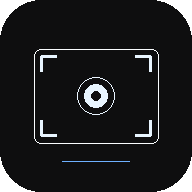

<div align="center">



# Clutch

**Минималистичный инструмент скриншотов для Windows** — трей, глобальные горячие клавиши, мгновенное копирование в буфер и режим с выделением области и простым редактором (стрелка, маркер, рамка).

[](LICENSE)
[](https://www.electronjs.org/)
[](https://github.com/pxdxx/Clutch/releases)

<br>

### Скачать

| Способ | Ссылка |
|--------|--------|
| **Установщик (рекомендуется)** | [**Releases → последняя версия**](https://github.com/pxdxx/Clutch/releases/latest) — файл `Clutch-1.0.0-Setup.exe` (имя может отличаться по версии) |
| **Исходный код** | [`github.com/pxdxx/Clutch`](https://github.com/pxdxx/Clutch) · `git clone https://github.com/pxdxx/Clutch.git` |

<br>

</div>

---

## Возможности

- Иконка в **системном трее** — приложение остаётся активным после закрытия окна настроек
- **Несколько мониторов** — снимок экрана берётся с дисплея, на котором находится курсор
- **Быстрый кадр** — выделение области → PNG сразу в буфер обмена
- **Редактор** — выделение → панель инструментов: стрелка, маркер, рамка, цвет, отмена, копирование, сохранить как
- **Горячие клавиши** настраиваются в окне настроек (в т.ч. отдельные клавиши F1–F12, Print Screen и др., см. приложение)

---

## Скриншот интерфейса

Логотип репозитория отображается выше (файл из репозитория: `icons/png/clutch-icon-192.png`). При желании добавьте свои скриншоты в папку `docs/` и вставьте их в этот раздел через ``.

---

## Требования

- **Windows 10/11** (x64)
- [Node.js](https://nodejs.org/) **20+** — только для сборки из исходников

---

## Разработка

```bash
git clone https://github.com/pxdxx/Clutch.git
cd Clutch
npm install
npm start
```

### Пересборка `.ico` из SVG

После правок `icons/svg/clutch-icon-512.svg`:

```bash
npm run build:icons
```

---

## Сборка установщика (Windows)

```bash
npm run dist
```

Готовый **NSIS-установщик** появится в папке **`release/`** (например `Clutch-1.0.0-Setup.exe`). Его можно загрузить в [GitHub Releases](https://docs.github.com/en/repositories/releasing-projects-on-github/managing-releases-in-a-repository).

Кратко: **Releases → Draft a new release → тег версии (например `v1.0.0`) → прикрепить `.exe` из `release/` → Publish release**.

---

## Git и GitHub

Репозиторий: **[github.com/pxdxx/Clutch](https://github.com/pxdxx/Clutch)**. Логин в ссылке (`pxdxx`) — это и есть «имя пользователя GitHub».

Если проект только локально и remote ещё не настроен:

```powershell
git init
git add .
git commit -m "Initial release: Clutch screenshot tool"
git branch -M main
git remote add origin https://github.com/pxdxx/Clutch.git
git push -u origin main
```

Дальше: `npm run dist` и загрузка **`release/Clutch-*-Setup.exe`** в [Releases](https://github.com/pxdxx/Clutch/releases).

---

## Структура проекта

```
clutch/
├── main.js           # главный процесс Electron
├── preload.js        # безопасный мост IPC
├── renderer/         # окно настроек и оверлей захвата
├── icons/
│   ├── ico/          # clutch.ico (Windows)
│   ├── png/          # растровые размеры
│   └── svg/          # исходники векторной иконки
├── scripts/          # build-icons.mjs (dev)
└── release/          # артефакты electron-builder (в .gitignore)
```

---

## Лицензия

[MIT](LICENSE)

---

<div align="center">

Сделано с использованием [Electron](https://www.electronjs.org/)

</div>
